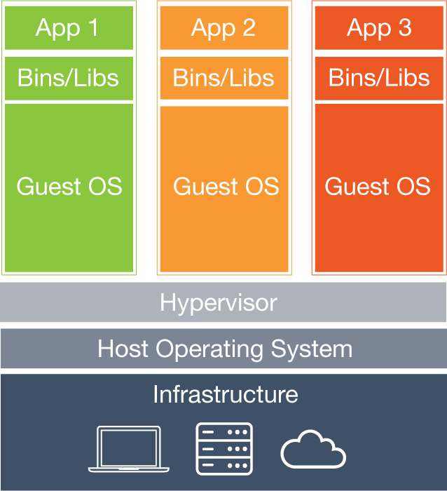
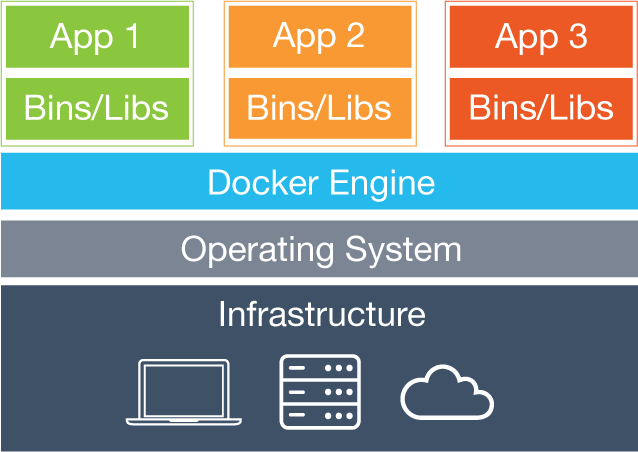

This is an introductory post to containers and Docker. This post is for you if you are completely new to containerization, or have heard of Docker and are wondering what all the buzz is about.

## What are containers?
A container is the term used for technology at the OS level that creates a modified runtime environment where programs running in that environment are isolated from other resources in the operating system. FreeBSD has had this concept in the form of [jails](https://www.freebsd.org/doc/handbook/jails.html) since FreeBSD 4.x. In Linux, containerization is accomplished using [cgroups](https://www.kernel.org/doc/Documentation/cgroup-v1/cgroups.txt) and [namespaces](http://man7.org/linux/man-pages/man7/namespaces.7.html). These tools have made system administration easier by providing the means to create safe, clean environments to install and run software.

## What is Docker?
When people talk about Docker, they are usually referring to the Docker Engine, which is a command line tool and daemon that makes working with Linux containers much easier. However, Docker the company and open source project was launched in 2013 and now offers a whole ecosystem of projects and products around containers in addition to the Docker Engine.

* [Docker Cloud](https://www.docker.com/products/docker-cloud) - A hosted service for Docker container management and deployment.
* [Docker Hub](https://www.docker.com/products/docker-hub) - A cloud hosted service that provides registry capabilities for public and private Docker images.
* [Docker Compose](https://www.docker.com/products/docker-compose) - A command-line tool used to define multi-container environments.
* [Docker Machine](https://www.docker.com/products/docker-machine) - A command-line tool to set up Docker on your computer, cloud servers, or data center.
* [Docker Swarm](https://www.docker.com/products/docker-swarm) - Makes running distributed applications easier by turning a group of Docker engines into a single, virtual Docker Engine.

## Docker is not a virtualization technology

### Virtualization

Source: https://www.docker.com/what-docker

Virtual machines achieve isolation by creating virtual hardware that sits on the existing host's hardware. For this reason, they are often slow to start, and require the host to have enough resources (RAM, CPU) to adequately share resources. Some virtualization technologies you may be familiar with are [vmware](http://www.vmware.com/), [VirtualBox](https://www.virtualbox.org/), and [Vagrant](https://www.vagrantup.com/).

### Docker

Source: https://www.docker.com/what-docker

Docker, on the other hand, leverages Linux namespaces and cgroups to allow programs in Docker containers to interface directly with the host's Linux kernel. These containers run in userspace as isolated child processes of the Docker daemon. As a result, Docker containers use less resources than on the host machine than virtualization technologies.

## What problems does Docker solve?
#### Deployment and dependency management
Whether it's on the server or your local development environment, managing dependencies and runtimes can become a real hassle. As an example, consider a server running a typical LAMP stack. As you add applications, it gets harder and harder to keep the versions of Apache, MySQL, and PHP in check. Upgrading to the latest PHP for your new app might break existing ones.

Using Docker, every application is contained and isolated with all of its dependencies. You could have several dockerized LAMP containers on one server all running with the exact versions of MySQL and PHP they require.

Deploying software is now a breeze! The only dependency is Docker. As long as the environment you want to deploy to supports Docker, you're golden.

#### Scaling
Since Docker containers don't use virtualization, they can spin up and down in seconds. This matters when it comes time to scale your infrastructure on demand to handle load.

#### Dev/production parity
How many times have you developed a new feature in your local environment, only to have it fail in production? Many headaches have been caused by differences between development, testing, and production environments. When you develop your app inside a Docker container, you are developing in the same environment where your app will run in production. This enables you to ship more reliable software faster.

Thanks for reading!
